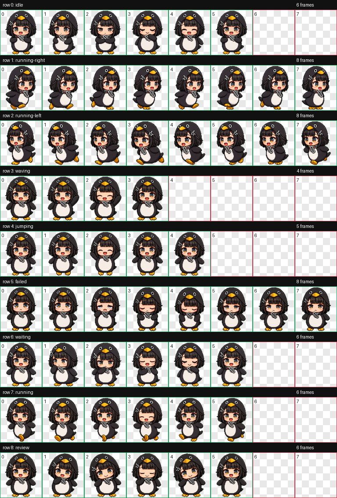

<div align="center">

# 活泼版本咕咕嘎嘎


**会在 Codex 里陪你工作的咕咕嘎嘎小企鹅。**<br>
软萌、犯困、会挥手，也会在你忙的时候悄悄动起来。

<p>
  
  
  
  
</p>

[下载 ZIP](dist/guga-lively.zip) · [查看完整动作表](qa/contact-sheet.png) · [挥手 MP4](qa/videos/jumping.mp4)

</div>

---

## 一句话介绍

`guga-lively` 是一个 Codex 自定义宠物包：黑色企鹅外套、圆滚滚身体、困困表情、快速小动作，还有已经恢复好的经典挥手动作。

它适合放在 Codex 里当一个不吵闹但很有存在感的桌面小伙伴。

## 立刻安装

### Windows PowerShell

```powershell
$petDir = "$HOME\.codex\pets\guga-lively"
New-Item -ItemType Directory -Force -Path $petDir | Out-Null
Invoke-WebRequest "https://github.com/guleguleguru/gugugaga-pet/raw/main/dist/guga-lively.zip" -OutFile "$env:TEMP\guga-lively.zip"
Expand-Archive "$env:TEMP\guga-lively.zip" -DestinationPath $petDir -Force
```

### macOS / Linux

```bash
mkdir -p ~/.codex/pets/guga-lively
curl -L "https://github.com/guleguleguru/gugugaga-pet/raw/main/dist/guga-lively.zip" -o /tmp/guga-lively.zip
unzip -o /tmp/guga-lively.zip -d ~/.codex/pets/guga-lively
```

安装后重新打开 Codex，选择或启用 `guga-lively`。

## 动作预览

<div align="center">
  
</div>

| 状态 | 说明 |
| --- | --- |
| `idle` | 待机小动作，适合不点击时自然播放 |
| `running-right` / `running-left` | 左右移动 |
| `waving` | 招手互动 |
| `jumping` | 已恢复为之前那版经典挥手感动作 |
| `failed` | 按用户参考图替换过的委屈失败表情 |
| `waiting` | 等待时更丰富的闲置动作 |
| `running` | 通用移动循环 |
| `review` | 审阅/观察状态 |

## 包里有什么

```text
guga-lively/
  pet.json
  spritesheet.webp

dist/
  guga-lively.zip

qa/
  guga-lively-waving.gif
  contact-sheet.png
  videos/jumping.mp4
```

## 构建状态

- 最终安装包：`guga-lively/pet.json` + `guga-lively/spritesheet.webp`
- 精灵图规格：`1536 x 1872`，8 列 x 9 行
- 当前版本：已清理绿幕边缘，已恢复旧版挥手动作
- 校验结果：`review_ok=true`，`validation_ok=true`

## 鸣谢

这个宠物来自咕咕嘎嘎风格参考，并针对 Codex 自定义宠物格式整理成可直接安装的版本。
